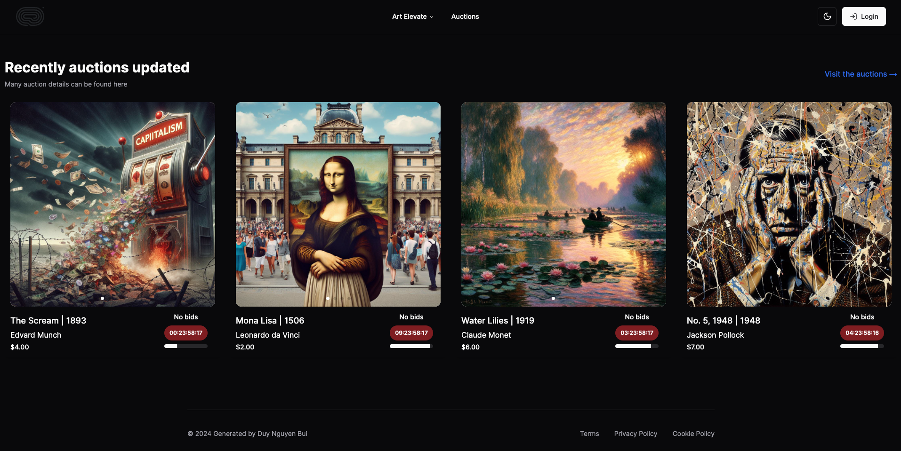
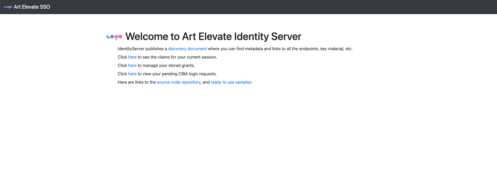
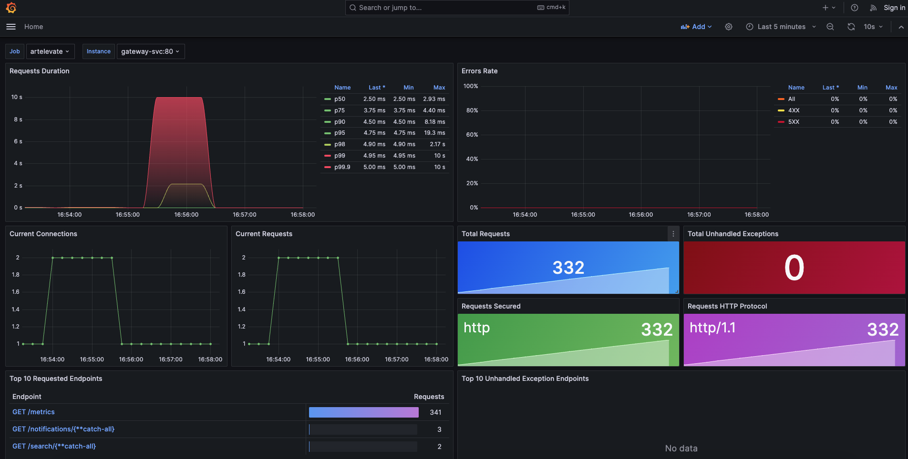
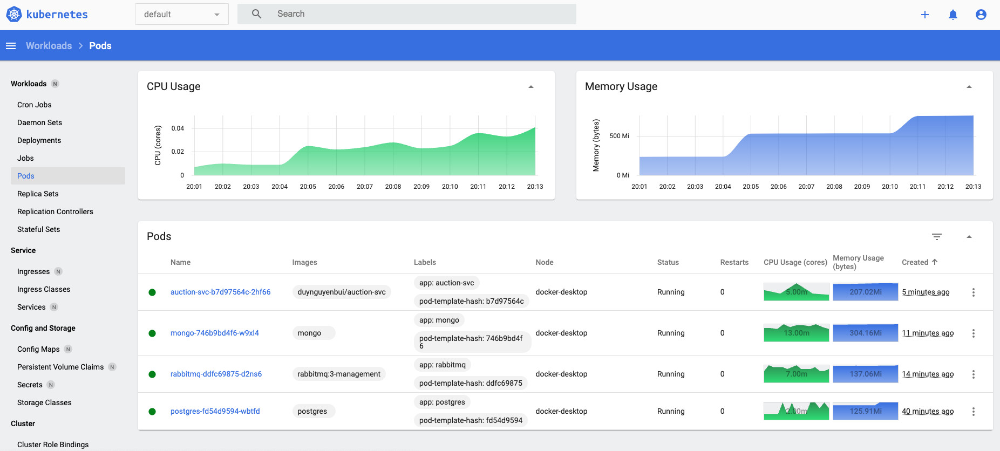

## CT250 Software Development Project

### Project: Real-time Art Work Auction Webiste Using Services-based Architecture
### Đề Tài: WEBSITE ĐẤU GIÁ TÁC PHẨM NGHỆ THUẬT THEO THỜI GIAN THỰC SỬ DỤNG KIẾN TRÚC DỰA TRÊN DỊCH VỤ

---

### Frameworks and Technologies:

- **Frameworks:**
  - [Next.js 14](https://nextjs.org/)
  - [.NET 8](https://dotnet.microsoft.com/)

- **Technologies:**
  - Utilizing a [three-tier architecture](https://www.ibm.com/topics/three-tier-architecture) for each service
  - Web Socket [(SignalR)](https://dotnet.microsoft.com/apps/aspnet/real-time)
  - Message Broker [RabbitMQ](https://www.rabbitmq.com/)
  - [Nginx](https://nginx.org/) server and [Yarp](https://github.com/microsoft/reverse-proxy) gateway
  - [gRPC](https://grpc.io/) to enhance performance
  - [Entity Framework Core](https://docs.microsoft.com/en-us/ef/core/)
  - JWT Token using [NextAuth](https://next-auth.js.org/) and [Duende Identity Server](https://duendesoftware.com/products/identityserver)
  - [Tailwind CSS](https://tailwindcss.com/) for the user interface (Shadcn/ui)

---

### Testing and Deployment:

- Unit Testing and Integration Testing using [xUnit](https://xunit.net/) and [WebFactory](https://learn.microsoft.com/en-us/aspnet/core/test/integration-tests?view=aspnetcore-7.0)
- Utilization of [Docker](https://www.docker.com/)/[Kubernetes](https://kubernetes.io/) for building, managing, and deploying

---

### Demo

#### Website Nextjs
  
#### Duende Identity Server
  
#### Prometheus - Grafana
  
#### Kubernetes
  

---